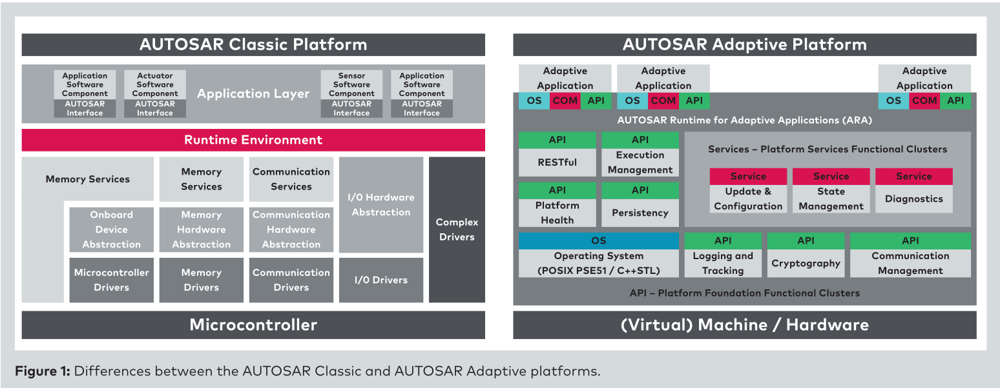
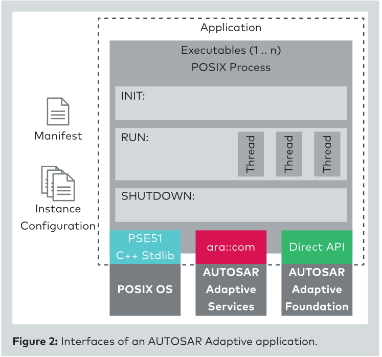

# Intro

* **AUTOSAR for Connected and Autonomous Vehicles: The AUTOSAR Adaptive Platform** （2016 46th IEEE/IFIP）

  AUTOSAR自适应平台以服务和API的方式提供接口，为了支持应用动态部署、需要高端计算能力的应用。

* **AUTOSAR the Next Generation – The Adaptive Platform**（2015 AUTOSAR PPT）

  AUTOSAR历史介绍和Adaptive AUTOSAR的介绍。

  **未来对于汽车软件系统的要求包括**，1.高度自动化：高可靠、**支持跨域计算**、支持高性能控制器、**分布式和远程诊断**；2.V2X（Vehicle to everything，车对外界的信息交换）应用要求汽车和外部系统（如win、linux、android）交互：支持云连接；软件产品；非AUTOSAR系统的集成；3.接入云的汽车需要专门的安全措施：**车内通信安全**；**安全的架构**；**安全的云连接**;4.汽车软件系统更紧密的交互：方法论中考虑非AUTOSAR及车外系统、**软件组件的动态部署**、同非AUTOSAR及车外系统的交互。

  **未来的研究**包括，1.基于POSIX的操作系统；2.用于实现面向服务通信的中间件技术，如SOME/IP（Scalable service-Oriented MiddlewarE over IP）；3.定义执行模型（excution models），支持不同应用场景，比如Full Access，[沙箱](./sandboxing.md)；4.使用包格式和管理器进行应用程序部署

* **The Computing Center in the Vehicle:AUTOSAR Adaptive**（2018 VECTOR）

  传感器海量数据要求汽车网络具备大通信带宽、低延时的特点。处理器在特定的硬件帮助下执行复杂的算法。在整个处理过程中，甚至包括传感器和执行器，都要集成安全和低延时措施。以下是AUTOSAR架构内部细节：

  

  

  **Adaptive特点（见Figure1）**：1.AUTOSAR Runtime for Adaptive Applications（ARA）：提供ECU内部和内部网络通信、基础服务接口（比如诊断Diagnostics、网络管理Communication Management）；2.[PSE51](./PSE51.md)：应用可通过POSIX子集PSE51（Minimum Real-Time System Profile）直接访问操作系统；3.Adaptive应用至少有一个进程，每个进程加载到虚拟地址空间执行，并由执行管理器（Execution Management）管理；4.更新和配置管理（UCM, Update & Configuration Management），应用可以移除、增加、更新；5.使用C++——面向对象、动态内存管理、标准库；6.面向服务的架构，应用提供了服务接口（见Figure 2）；6.多个ECU在Adaptive平台上执行，通过Ethernet网络连接，基于SOME/IP（Scalable Service Oriented Middleware overIP）协议 。

  