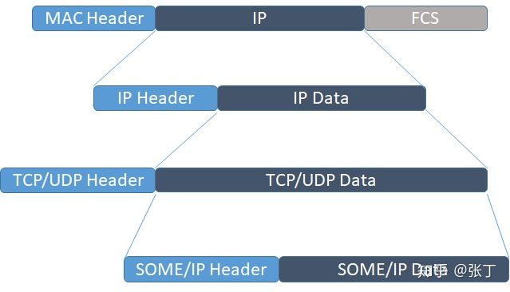
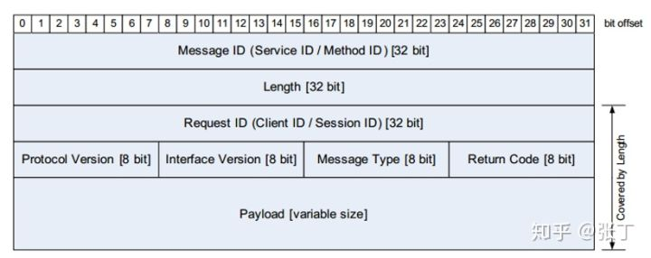
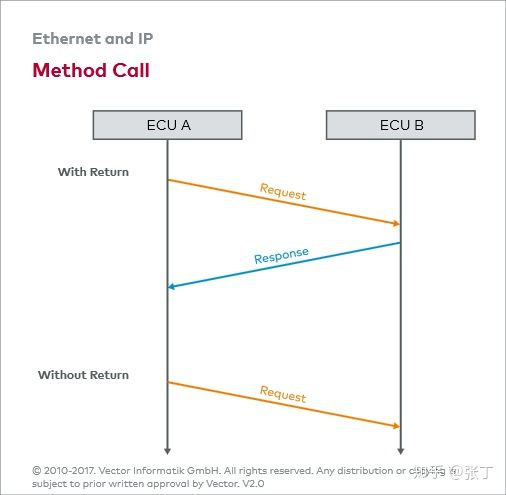
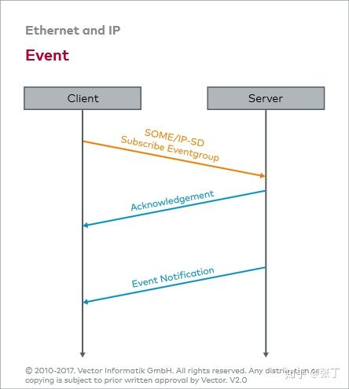
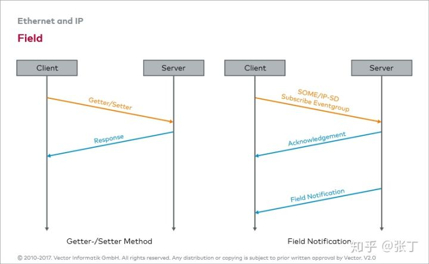
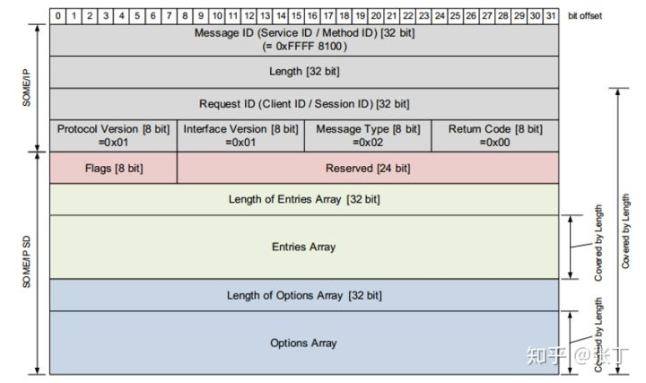

# SOME-IP

SOME/IP (Scalable service-Oriented MiddlewarE over IP) 是车载以太网通信引入的一个概念，位于传输层（IP）之上的的应用层通信协议。SOME/IP不同CAN，它是在接收方有需求的时候才发送，这种方法的优点在于总线上不会出现过多不必要的数据，从而降低负载。

SOME/IP数据的格格式如下：

其中，除了Payload外都是Header，Header中的Message Type [8 bit]是数据包的类型：

- REQUEST （期待响应的请求）
- REQUEST_NO_RETURN（不期待响应的请求）
- NOTIFICATION（事件通知）
- RESPONSE（响应消息）
- ERROR（报错消息）

**REQUEST**会要求有响应**RESPONSE**，而**REQUEST_NO_RETURN**不要求有**RESPONSE**。

**NOTIFICATION**属于事件通知类的服务，首先由client向server订阅服务内容，然后server向client自动发布服务内容。NOTIFICATION分为两种——Event和Field。首先使用SOME/IP-SD(Service Discovery)来进行服务订阅，然后才能发布通知。区别在于，Event是某一时刻的快照，只是事件通知，而Field除了事件通知之外，还具有Getter和Setter的功能，即对信息进行读写的操作。

SOME/IP-SD可以被当作SOME/IP的一种特殊服务，前面提到过，client可以远程调用server提供的服务，或者订阅server发布的内容，那么client是怎么知道server提供哪些服务呢，就是通过SOME/IP-SD来实现服务发现过程的。SOME/IP-SD提供了两种动态发现服务的机制。一种是Offer Service ，由server向网络上发布它所提供的服务；另一种是Find Service ，由client向别人请求可用的服务。

